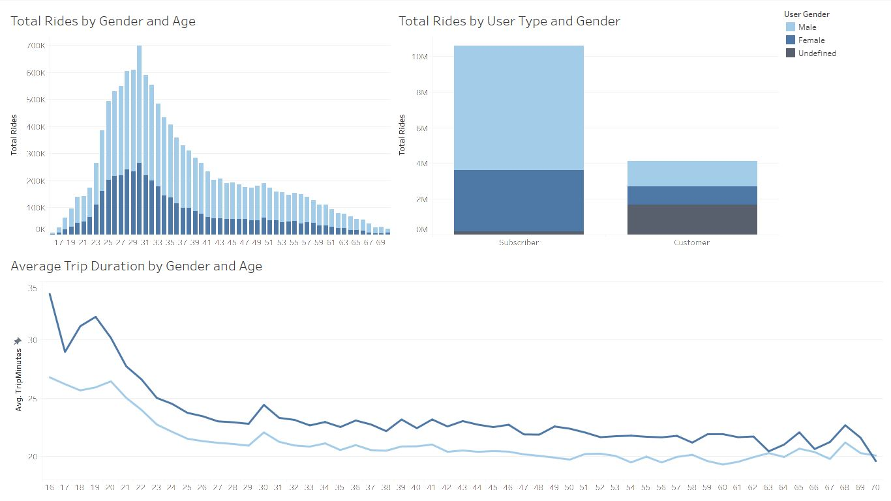
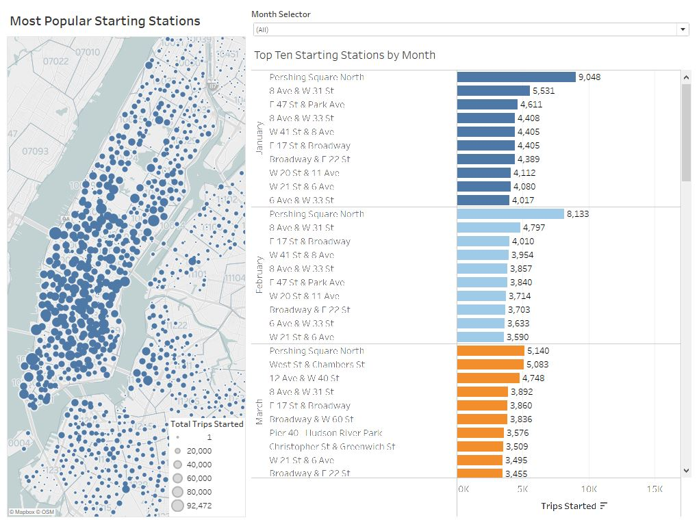
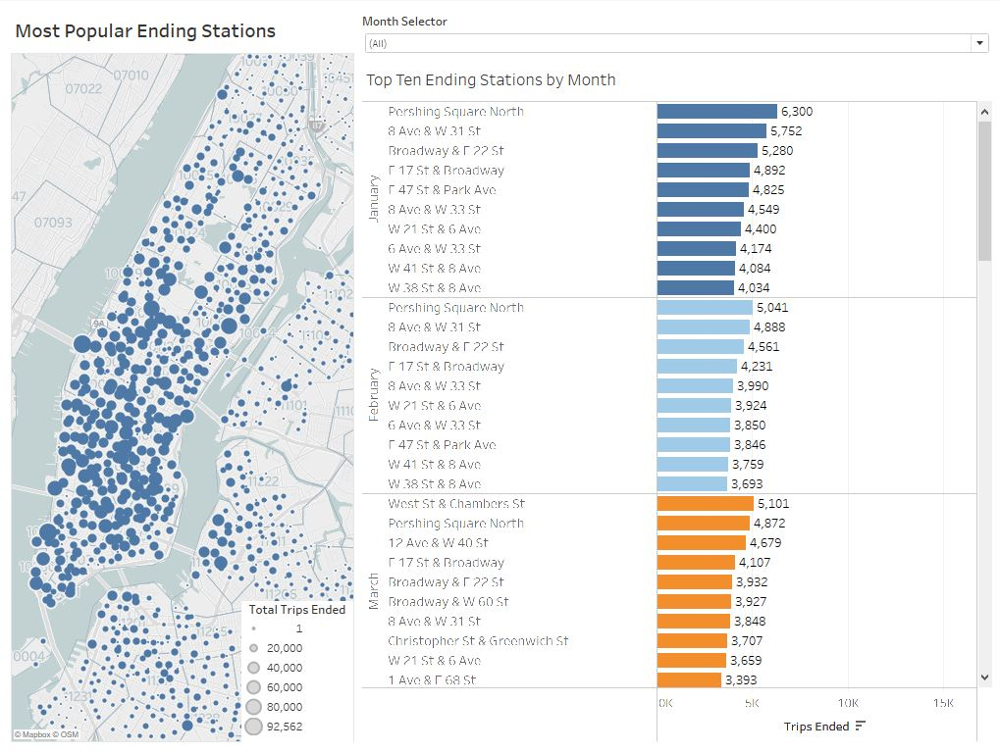
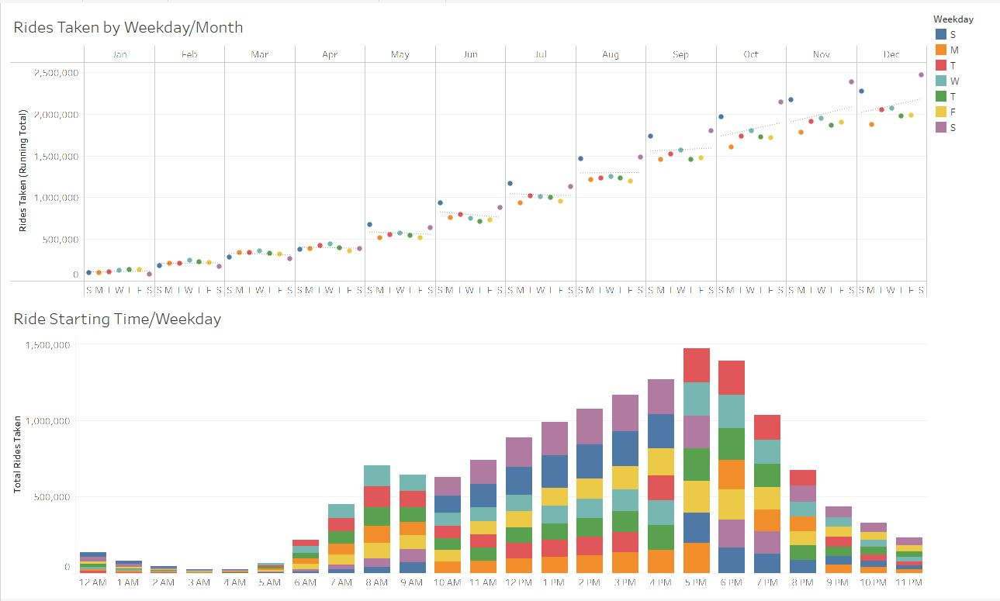

# Tableau Challenge
Dave Wisinski
----
July 2021
----
----

## Purpose/Process

The purpose of this project is demonstrate a number of data visualization concepts using only Tableau.

Source data (comprised of twelve separate .csv files) was combined via "union" in Tableau, and preliminarily filtered in order to meet the acceptability/usability criteria for the Public version of the software (19M+ records were pared down to <15M by eliminating outlier ride data with a duration less than six minutes or greater than 24 hours).

## Source Data

Data from all of 2020 was sourced from the [Citi Bike NYC](https://www.citibikenyc.com/system-data) [trip data repository](https://s3.amazonaws.com/tripdata/index.html).

## Data Visualizations and Trends

Some readily apparent trends are visible when examining the demographic breakdown of Citi Bike's 2020 userbase and their respective usage.

The userbase is primarily male, aged between 25-33. Additionally, subscriber users (annual members) outnumber customer users (24-hour pass or 3-day pass users) by a ratio of approximately 2.5 to 1. Also apparent from this data is that customer users prefer not to share their personal demographic information with Citi Bike, as the majority of customers declined to provide their gender and/or birth date (more on that later).

Additionally visible is the strong negative correlation between average trip duration and user age. The youngest members of the userbase logged the longest average trip durations (averaging trips between 25-33 minutes for those under the age of 20), while average trip times gradually declined with increasing age. Trip duration and age data was filtered to exclude those users with a stated age over 70 due to unreliable data, and customer users were excluded entirely from the average trip duration calculations due to an inordinate amount of customers reporting a birth year of 1969 (for dubious reasons).

In examining the most popular stations to start a ride in 2020, the predominant trend is the high concentration of stations located in lower Manhattan, likely due to the popularity of the program with urban commuters. Notably, during the beginning of the year, the most popular stations to start a ride were concentrated near [Grand Central Station](https://www.citibikenyc.com/attractions/grand-central), while trips beginning in summer and early fall months tended to be concentrated closer to the Manhattan side of the Hudson River, including the station directly adjacent to the [West 39th Street Ferry Terminal](https://goo.gl/maps/xLeeCPdBdcW68NW48), likely suggesting a positive correlation to other seasonal commuting trends (taking the ferry to Manhattan in warmer months, etc.) as users utilized Citi Bike as the "last leg" of their daily commutes into the city.

Similar trends are visible in the mapping of the most popular stations to end a ride, again likely indicating a positive correlation to urban commuters reversing the same methods of transportation and routes taken into Manhattan earlier in the day (i.e. utilizing Citi Bike as the "first leg" of their trips home).

Finally, when examining data related to the most popular days of the week and times to utilize the Citi Bike system, a number of additional ridership trends are visible. When first examining the running total of rides taken throughout the year, it is apparent that usage accelerated in the summer months as warmer weather became more prevalent. Significant growth in usage was seen in July for example, with Sundays in July being the first day of the week to break the million ride mark following month over month growth on Sundays of approximately 77% in May and 39% in June. Saturdays subsequently broke the two million ride mark just a few months later in October, further indicating the rapid rise in utilization of the bikes over the summer and early fall months.

Loosely fitted trend lines are also drawn illustrating the general trend in weekly rides during each month. Weekly usage was relatively flat to slightly positive during the early portion of the year (and during the initial wave/lockdown related to [COVID-19](https://en.wikipedia.org/wiki/COVID-19_pandemic_in_New_York_City)). Interestingly, weekly usage trended down during the week in the months of May through July, potentially related to declining levels of commuters entering Manhattan during the week. This trend began to shift later in the year, and from mid-fall through early winter, the clear trend was an increase in usage as the week progressed, notable Monday through Wednesday, culminating in a peak as Saturdays became the most active day for riders to utilize the system.

When examining the most popular ride start times by day of the week, some other notable trends are visible. For example, rides beginning between the hours of 7AM and 9AM and between 5PM and 7PM are most prevalent on weekdays (Monday through Friday), likely related again to urban commuters, while the daytime usage (between the hours of 10AM and 4PM) is most common on Saturdays and Sundays, potentially related to higher rates of recreational and/or errand-related trips vs. the higher rate of work commute-related trips taken during the week. Also unsurprisingly, late night trip start times (beginning after 9PM) are highest on Saturdays, and early morning  trips (before 5AM) tend to occur on Sunday mornings, again pointing to a likely positive correlation to high rates of recreational use on the weekends. Additional data would be required in order to further definitively correlate these trends to potential other lifestyle-related factors.

## Notes

Images above are located in the /Images folder.

Please see the Tableau Public interactive web version of this project [here](https://public.tableau.com/app/profile/david.wisinski/viz/CitibikeProject_16259768148620/CitibikeNYC2020).
